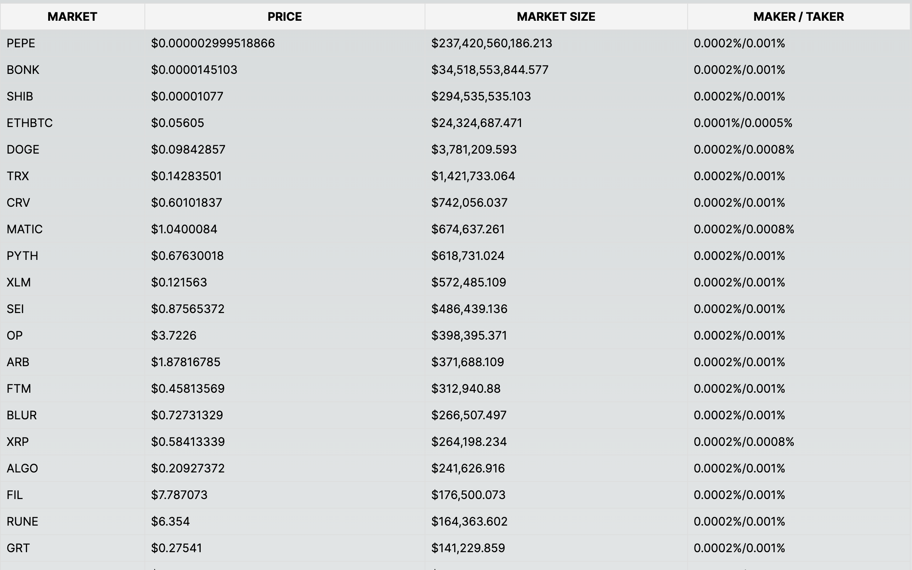

## Getting Started

Setup:

`npm install`

Run the dev server:

```bash
npm run dev
```

Open [http://localhost:3000](http://localhost:3000) with your browser to see the result.

## Display a list of cryptocurrency markets from the Optimism.

